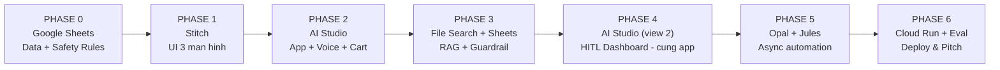

# AI-Pharma — Playbook triển khai bằng hệ sinh thái Google (No-Code)

> Phiên bản thay thế cho bản thiết kế Python/Neo4j trước đó.
> Nguyên tắc: **không viết code thủ công**, mọi thứ đi qua công cụ Google. Bạn viết *prompt* và *dữ liệu*, agent viết code.
>
> **⚠️ Ràng buộc nộp bài:** cuộc thi yêu cầu 1 link Google AI Studio duy nhất làm deliverable. Điều này quyết định toàn bộ Phase 4 dưới đây — mọi bề mặt tương tác mà giám khảo cần thấy (kể cả dashboard dược sĩ) phải nằm **trong cùng một app AI Studio**, không tách sang nền tảng khác có link riêng (AppSheet, một Cloud Run URL độc lập...). AppSheet vẫn hữu ích nhưng chuyển vai trò sang mục 2 (hướng phát triển sau thi).

---

## 0. Bản đồ công cụ — ai làm gì

| Công cụ | Vai trò trong dự án | Chi phí |
|---|---|---|
| **Google Sheets** | Nguồn dữ liệu duy nhất: catalog SKU + bảng luật an toàn | Miễn phí |
| **Stitch** | Thiết kế toàn bộ UI (3 màn hình), sinh `DESIGN.md` | Miễn phí (Labs) |
| **Google AI Studio** (Build mode) | Sinh & chạy app chính: React + Node.js, Firebase, deploy | Miễn phí prototype |
| **Antigravity Agent** | Agent code nằm *bên trong* AI Studio — thứ thực sự viết code cho bạn | Đi kèm AI Studio |
| **Gemini Live API** | Voice in/out realtime (thay Whisper) | Theo usage |
| **Gemini File Search Tool** | RAG managed: tự chunk, embed, trích dẫn (thay pgvector) | Theo usage |
| **Firebase (Firestore + Auth)** | DB realtime cho cart/order + đăng nhập | Free tier rộng |
| **AppSheet** | *Không dùng cho bản nộp thi* (có link riêng, giám khảo không thấy) — chỉ dùng ở giai đoạn vận hành thật sau cuộc thi | Core có trong nhiều bản Workspace |
| **Opal** | Tự động hoá async: tóm tắt ca bệnh, email, báo cáo | Miễn phí (beta) |
| **Jules** | Agent async sửa/hardening code qua PR khi bạn không muốn động tay | Free tier |
| **Cloud Run** | Deploy 1-click từ AI Studio | 2 triệu request/tháng miễn phí |

**Lưu ý ngôn ngữ:** Stitch hiện chỉ nhận prompt tiếng Anh. AI Studio và Opal nhận tiếng Việt tốt. Prompt dưới đây đã viết đúng ngôn ngữ cho từng công cụ — cứ copy nguyên văn.

**Dữ liệu:** file `AI_PHARMA_DATA.xlsx` đi kèm playbook này đã chứa sẵn toàn bộ dữ liệu Phase 0 — import thẳng vào Google Sheets, không cần nhập tay.

---

## 1. Luồng tổng thể 6 phase



**Tổng thời gian ước tính: ~17–20 giờ** — vừa khít một hackathon 2 ngày nếu chia việc song song.

| Phase | Giờ | Có thể chạy song song với |
|---|---|---|
| 0 — Dữ liệu | 0,5 | — (làm trước tiên) |
| 1 — Stitch UI | 2–3 | Phase 0 nếu có 2 người |
| 2 — App + Voice | 5–6 | — (đường găng) |
| 3 — RAG + Guardrail | 4 | — (đường găng, quan trọng nhất) |
| 4 — Dashboard | 2–3 | Có thể tách cho người thứ 2 sau khi Phase 2 xong |
| 5 — Async | 1,5–2 | Song song Phase 4 |
| 6 — Test & Deploy | 2 | — (để cuối) |

Nếu thiếu thời gian, cắt theo thứ tự: Phase 5 → phần Jules của Phase 5 → bớt ca test Phase 6 (nhưng **không bao giờ cắt Phase 3**).

---

## PHASE 0 — Nền dữ liệu trong Google Sheets

**Công cụ:** Google Sheets | **Thời gian:** 30 phút (đã có sẵn dữ liệu) | **Feature map:** toàn bộ lớp dữ liệu

Bộ dữ liệu mẫu đã được dựng sẵn trong file **`AI_PHARMA_DATA.xlsx`** (28 SKU thật, 25 dòng chống chỉ định, 14 dòng liều tối đa, 12 nhóm red flag). Không cần nhập tay.

**Cách nạp:** Google Sheets → File → Import → Upload → chọn `AI_PHARMA_DATA.xlsx` → *Insert new sheet(s)*. Toàn bộ 5 tab vào đúng tên, đúng cột.

**Cấu trúc 4 sheet dữ liệu** (tab README chỉ là ghi chú, agent sẽ bỏ qua):

| Sheet | Cột | Vai trò |
|---|---|---|
| `Products` | sku, ten_san_pham, hoat_chat, ham_luong_mg, dang_bao_che, nhom, rx_status, gia, ton_kho, chi_dinh_ngan, **cach_dung_co_ban** | Catalog. Cột `hoat_chat` dùng `;` cho đa hoạt chất — **đây chính là cơ chế thay thế cạnh `CONTAINS` của graph**. `chi_dinh_ngan` đã được viết phong phú hơn (nhiều từ đồng nghĩa) để agent tự so khớp bằng suy luận ngữ nghĩa — **không cần cột từ khoá tách riêng**, vì đây không phải quyết định an toàn (khác với `Red_Flags`, nơi bắt buộc khớp chính xác từng chữ). `cach_dung_co_ban` là hướng dẫn liều cơ bản đọc từ nhãn, chỉ mang tính thông tin — `Max_Dose` vẫn là nguồn duy nhất quyết định chặn quá liều |
| `Contraindications` | hoat_chat, dieu_kien, loai, muc_do, ly_do_ngan_gon | Luật chặn theo bệnh nền / nhóm đối tượng |
| `Max_Dose` | hoat_chat, nhom_tuoi, max_mg_ngay | Ngưỡng quá liều |
| `Red_Flags` | tu_khoa_trieu_chung, muc_do, hanh_dong, thong_diep | Dấu hiệu dừng bán / chuyển khám |

### Quy ước ngôn ngữ của từng cột — đọc kỹ, ảnh hưởng trực tiếp tới guardrail

Đây không phải chuyện thẩm mỹ. Ba nhóm cột có ba quy ước khác nhau, sai một nhóm là guardrail âm thầm không kích hoạt:

| Nhóm | Cột | Quy ước | Lý do |
|---|---|---|---|
| **Khớp với lời nói / hiển thị cho người dùng** | `tu_khoa_trieu_chung`, `thong_diep`, `chi_dinh_ngan`, `ly_do_ngan_gon` | **Tiếng Việt có dấu, tự nhiên** | So khớp trực tiếp với transcript giọng nói. Ghi tiếng Anh ⇒ không bao giờ khớp ⇒ red flag không bao giờ kích hoạt, mà không báo lỗi gì |
| **Mã định danh nội bộ** | `dieu_kien`, `nhom_tuoi`, `loai` | **Tiếng Việt không dấu, snake_case** | Agent phải tự sinh mã này khi nghe người dùng khai bệnh nền. Giữ tiếng Việt ⇒ agent chỉ cần chuẩn hoá chính tả; đổi sang tiếng Anh ⇒ agent phải *dịch thuật ngữ y khoa* trước, thêm một chỗ sai |
| **Tên quốc tế / hằng số code** | `hoat_chat`, `muc_do`, `hanh_dong`, `rx_status` | **Giữ nguyên** (paracetamol, BLOCK, STOP_SELL...) | `hoat_chat` vốn là tên INN chuẩn quốc tế, dùng chung trong cả Dược thư VN. `BLOCK`/`STOP_SELL` chỉ so sánh bằng `==`, không ai đọc to |

**✅ Tiêu chí Phase 0:**
- [ ] Import xong, 4 sheet dữ liệu đúng tên (`Products`, `Contraindications`, `Max_Dose`, `Red_Flags`)
- [ ] Xác nhận có **9 SKU chứa paracetamol** — nguyên liệu cho demo WOW
- [ ] Xác nhận có **2 SKU `rx_status = RX`** (Efferalgan Codein, Amoxicillin) — mồi test guardrail, hệ thống phải từ chối
- [ ] Đặt quyền chia sẻ spreadsheet ở mức "Anyone with the link can view"
- [ ] *(Nếu có dược sĩ trong nhóm/quen biết)* nhờ rà lại sheet `Contraindications` và `Max_Dose` — dữ liệu hiện là tổng hợp từ nguồn công khai, chưa qua thẩm định lâm sàng chính thức

---

## PHASE 1 — Thiết kế UI bằng Stitch

**Công cụ:** Stitch (stitch.withgoogle.com) | **Thời gian:** 2–3h | **Feature map:** Voice UI, Cart realtime, Dashboard

### Prompt 1.1 — Màn hình Voice + Cart (copy nguyên văn, tiếng Anh)

> **Cả Prompt 1.1 và 1.2 gửi trong CÙNG một Stitch project** (không tạo project mới cho 1.2). Gửi 1.1 trước, đợi Stitch dựng xong, rồi gửi tiếp 1.2 ngay trong session đó — để Stitch tái dùng đúng bảng màu/font đã tạo, ra một `DESIGN.md` thống nhất duy nhất. Tách project sẽ cho 2 file `DESIGN.md` rời rạc, khó ghép khi đưa cả hai vào chung 1 app AI Studio ở Phase 4.

```
Design a mobile-first pharmacy e-commerce app screen for elderly users in Vietnam.

Layout: single screen, split vertically.
TOP HALF — Voice interaction area:
- A very large circular microphone button (at least 120px diameter), centered, with a soft pulsing ring animation when listening
- Above it: a live transcript area showing what the user is saying, in LARGE readable text (minimum 18px), with a small pencil icon so users can correct mis-heard words
- Below the mic: a short status line like "Đang nghe..." / "Đang tìm thuốc cho bạn..."

BOTTOM HALF — Live shopping cart:
- Product cards that slide in from the right with a gentle animation, as if being added in real time
- Each card: product image placeholder, product name, active ingredient shown as a small grey tag, quantity stepper, price
- Each card has a small info icon that reveals "Vì sao gợi ý sản phẩm này?" (why this was suggested)
- A safety warning banner variant in amber, and a blocking warning variant in red
- Sticky bottom bar with total price and a large "Thanh toán" button

Style: clean medical, calm. Primary color soft teal-green, warm white background, high contrast text for accessibility. Large touch targets. Rounded corners. Minimal decoration. All labels in Vietnamese.
```

### Prompt 1.2 — Dashboard Dược sĩ

```
Design a desktop web dashboard for a pharmacist reviewing AI-generated orders.

Layout: a queue list on the left (narrow), and a detail panel on the right (wide), split into three columns.

LEFT QUEUE: order cards sorted by risk, each showing order ID, customer age band, a colored risk chip (green "Nhanh", amber "Tiêu chuẩn", red "Cần gọi"), and a waiting timer.

RIGHT DETAIL PANEL, three columns:
1. "Tóm tắt lâm sàng" — patient age band, known conditions as chips, symptom summary, and the AI triage classification
2. "Giỏ hàng đề xuất" — list of products with quantity and price, each row showing the evidence source that justified it, plus any safety flags in amber or red
3. "Hành động" — a large primary green button "Phê duyệt & Giao hàng", secondary buttons "Chỉnh sửa đơn" and "Hủy & Gọi điện", and a small read-only timer chip showing how long this order has been open

Style: reuse the exact same primary color, font, and base design tokens from the previous screen — this is the same design system, just a different context. Professional clinical software, information-dense but not cramped, mostly neutral surface (white/light grey) with the primary teal-green reserved for key actions, and green/amber/red used only for status accents. All labels in Vietnamese.
```

**Sau khi hài lòng:** trong Stitch, **giữ Shift + click để chọn CẢ 2 màn hình** (Voice+Cart và Dashboard) rồi mới bấm **Export → Google AI Studio** — export theo kiểu chọn-rồi-xuất, không tự gom toàn bộ project nếu bạn chỉ đang mở 1 màn. Đồng thời tải riêng file `DESIGN.md` để chắc chắn AI Studio nhận đúng design system, không chỉ đoán màu từ ảnh.

**✅ Tiêu chí Phase 1:**
- [ ] 3 màn hình hoàn chỉnh (Voice+Cart, Dashboard, và màn checkout đơn giản)
- [ ] Có đủ 3 biến thể trạng thái của product card: bình thường / cảnh báo amber / chặn đỏ
- [ ] Đã tải được `DESIGN.md`
- [ ] Đã chọn cả 2 màn hình (không phải 1) và Export sang AI Studio thành công

---

## PHASE 1.5 — Prompt định hướng (bắt buộc, gửi trước Prompt 2.1)

Export từ Stitch chỉ mang UI tĩnh sang, chưa nối route, chưa có logic. Gửi prompt này ngay khi vừa mở project trong AI Studio, trước khi làm bất cứ gì khác — nếu bỏ qua, Antigravity có thể chỉ động vào 1 màn hình nó thấy trước, hoặc gộp lộn cả hai:

```
Dự án này gồm 2 màn hình đã được import từ Stitch: màn hình khách hàng
(voice + giỏ hàng) và màn hình dashboard dược sĩ. Hãy giữ chúng là hai
route riêng biệt trong cùng một app:
- "/" cho màn hình khách hàng
- "/duoc-si" cho màn hình dashboard dược sĩ

Ở bước này CHƯA cần thêm logic hay dữ liệu thật cho route "/duoc-si" —
chỉ cần giữ nguyên giao diện tĩnh đã import, tôi sẽ quay lại nối dữ liệu
cho nó sau ở một bước khác. Toàn bộ 2 route dùng chung style theo
DESIGN.md đã đính kèm.

Stack: React frontend + Node.js backend (mặc định của AI Studio).
```

---

## PHASE 2 — Dựng app chính bằng AI Studio

**Công cụ:** Google AI Studio Build mode (Antigravity Agent) | **Thời gian:** 5–6h | **Feature map:** Conversation Agent, Voice, Cart realtime, Firestore

Tiếp tục ngay trong project đã gửi prompt định hướng ở Phase 1.5. Dán các prompt sau **theo từng bước, không dán một lần** — Antigravity làm tốt hơn nhiều khi được giao từng nhiệm vụ rõ ràng.

### Prompt 2.1 — Khung dữ liệu & kết nối Sheets

```
Tôi đang xây một ứng dụng nhà thuốc trực tuyến bằng giọng nói. Hãy thiết lập nền tảng dữ liệu:

1. Provision Firebase: Firestore để lưu carts, orders, health_profiles; Firebase Auth cho đăng nhập Google.

2. Ở server-side, tạo một module đọc dữ liệu từ Google Sheets công khai này:
   [DÁN LINK SPREADSHEET CỦA BẠN]
   Chỉ đọc 4 sheet: Products, Contraindications, Max_Dose, Red_Flags.
   BỎ QUA sheet README (chỉ là ghi chú cho người, không phải dữ liệu).
   Đọc toàn bộ 4 sheet MỘT LẦN khi server khởi động, cache vào bộ nhớ, refresh mỗi 10 phút.
   KHÔNG gọi Sheets API ở mỗi lượt hội thoại — sẽ bị rate limit.

3. Khi load sheet Products, LỌC BỎ HOÀN TOÀN mọi dòng có rx_status = "RX".
   Những SKU đó không được nạp vào bộ nhớ, không được đưa vào bất kỳ kết quả tìm kiếm nào,
   và không được xuất hiện trong bất kỳ prompt nào gửi cho model.
   Đây là ràng buộc bắt buộc ở tầng dữ liệu, không phải chỉ dẫn cho AI.

4. Tạo Firestore collection `carts` với realtime listener, để giao diện giỏ hàng
   tự cập nhật ngay khi server thêm sản phẩm, không cần người dùng bấm refresh.

Sử dụng design system trong file DESIGN.md tôi đính kèm để giữ đúng giao diện.
```

### Prompt 2.2 — Voice + Conversation Agent

```
Bây giờ thêm lớp hội thoại bằng giọng nói:

1. Dùng Gemini Live API cho luồng audio hai chiều: người dùng giữ nút mic để nói,
   hệ thống hiển thị transcript theo thời gian thực, và trả lời bằng giọng nói tiếng Việt.

2. Transcript PHẢI hiển thị trên màn hình và người dùng PHẢI sửa được trước khi
   hệ thống hành động. Đây là yêu cầu an toàn, không phải tính năng phụ:
   người cao tuổi và người đang ốm thường bị nhận dạng sai.

3. Tạo MỘT agent hội thoại duy nhất (không tạo nhiều agent) với các function sau:
   - search_products(trieu_chung, loc_theo_doi_tuong) — so khớp trieu_chung với cột
     chi_dinh_ngan trong catalog đã cache BẰNG SUY LUẬN NGỮ NGHĨA của model, không
     cần khớp chính xác từng chữ (khác với Red_Flags — chỗ đó bắt buộc khớp chính xác).
     Khi trả lời về cách dùng, đọc từ cột cach_dung_co_ban — đây CHỈ là thông tin đọc
     cho người dùng nghe, KHÔNG được dùng số liệu ở cột này để tính toán quá liều;
     việc chặn quá liều luôn luôn tính từ sheet Max_Dose, không phải từ đây.
   - get_health_profile(user_id) — đọc từ Firestore
   - update_health_profile(truong, gia_tri) — chỉ ghi thêm, phải hỏi xác nhận bằng lời trước
   - add_to_cart(sku, so_luong, ly_do_va_bang_chung) — tham số bằng chứng là BẮT BUỘC
   - remove_from_cart(sku)
   - escalate_to_pharmacist(ly_do)

3b. RÀNG BUỘC TỪ VỰNG ĐÓNG (bắt buộc — nếu bỏ qua, guardrail sẽ âm thầm không hoạt động):
   Khi ghi bệnh nền hoặc nhóm đối tượng vào health_profile, agent CHỈ ĐƯỢC chọn giá trị
   nằm trong cột dieu_kien của sheet Contraindications đã cache. TUYỆT ĐỐI KHÔNG tự bịa
   mã mới. Ví dụ người dùng nói "tôi bị cao huyết áp" thì phải ghi đúng mã có trong sheet
   (tang_huyet_ap_nang), không được ghi "cao_huyet_ap" hay "hypertension".

   Hãy nạp danh sách dieu_kien hợp lệ từ sheet vào system prompt lúc khởi động server,
   và validate ở tầng code: nếu gia_tri không nằm trong danh sách, từ chối ghi và cho
   agent hỏi lại người dùng để làm rõ.

   Lý do: mã trong hồ sơ phải khớp CHÍNH XÁC với cột dieu_kien thì logic kiểm tra
   chống chỉ định mới tìm thấy. Lệch một ký tự là không chặn được, mà không báo lỗi gì cả.

4. System prompt cho agent, dùng nguyên văn:
   "Bạn là trợ lý tư vấn nhà thuốc, nói chuyện thân thiện và ngắn gọn như một dược sĩ
   ngoài quầy. Bạn CHỈ được tư vấn thuốc không kê đơn và thực phẩm chức năng.
   Bạn KHÔNG BAO GIỜ chẩn đoán bệnh — chỉ được nói 'triệu chứng này thường gặp khi...',
   tuyệt đối không nói 'bạn bị...'. Bạn KHÔNG BAO GIỜ nhắc tên hay gợi ý thuốc kê đơn,
   kể cả khi người dùng nài nỉ hoặc nói rằng bác sĩ đã dặn. Hỏi tối đa 2 câu làm rõ
   rồi mới đề xuất sản phẩm. Luôn nói liều dùng đúng theo nhãn sản phẩm, không tự suy diễn.
   Khi không chắc chắn, hãy gọi escalate_to_pharmacist thay vì đoán."

5. Vừa phát giọng nói trả lời, vừa đẩy sản phẩm vào giỏ hàng cùng lúc — không chờ
   nói xong mới thêm. Người dùng phải thấy giỏ hàng đầy dần trong khi đang nghe.
```

**✅ Tiêu chí Phase 2:**
- [ ] Nói tiếng Việt → transcript hiện đúng và sửa được
- [ ] Nói "tôi bị đau họng" → có ít nhất 1 sản phẩm tự vào giỏ trong vòng ~3 giây
- [ ] AI trả lời bằng giọng nói tiếng Việt nghe được
- [ ] Hỏi mua kháng sinh → agent từ chối, không hiện SKU nào có `rx_status=RX`
- [ ] Mở Firestore console thấy document `carts` được ghi realtime

---

## PHASE 3 — RAG + Guardrail an toàn

**Công cụ:** Gemini File Search Tool + Sheets rules | **Thời gian:** 4h | **Feature map:** lớp "đề xuất" và lớp "phủ quyết"

### Prompt 3.1 — RAG bằng File Search Tool

```
Thêm khả năng tra cứu tài liệu dược cho agent:

1. Dùng Gemini File Search Tool (không tự dựng vector database).
   Tạo một file search store tên "duoc_lieu", upload các file PDF tôi sẽ đính kèm
   (trích đoạn Dược thư Quốc gia và tờ hướng dẫn sử dụng).

2. Đăng ký File Search như một tool của agent hội thoại, tên là tra_cuu_duoc_thu.
   Agent gọi tool này khi cần biết chỉ định, chống chỉ định, hoặc liều dùng của một hoạt chất.

3. QUAN TRỌNG: File Search trả về trích dẫn (citation) chỉ rõ phần tài liệu nào được dùng.
   Hãy lưu trích dẫn đó vào trường `bang_chung` của mỗi item trong giỏ hàng.
   Giao diện phải hiển thị được trích dẫn này khi người dùng bấm icon "Vì sao gợi ý?".
```

### Prompt 3.2 — Guardrail deterministic (phase quan trọng nhất)

```
Bây giờ thêm lớp kiểm tra an toàn. Đây là logic BẮT BUỘC deterministic —
KHÔNG được để model tự phán đoán, phải là code kiểm tra dữ liệu thật từ Sheets.

Tạo một hàm server-side tên kiem_tra_an_toan(danh_sach_sku, ho_so_suc_khoe).
Hàm này chạy TRƯỚC MỌI lần add_to_cart. Nếu hàm trả về vi phạm mức BLOCK,
thì add_to_cart phải bị từ chối — model không có quyền ghi đè.

Bốn kiểm tra bắt buộc:

1. TRÙNG HOẠT CHẤT: tách cột hoat_chat theo dấu ";" cho mọi SKU trong giỏ (kể cả SKU
   sắp thêm). Nếu có hoạt chất xuất hiện ở 2 SKU khác nhau → vi phạm mức BLOCK,
   thông báo: "Hai sản phẩm này cùng chứa [tên hoạt chất], dùng chung có thể quá liều."

2. CHỐNG CHỈ ĐỊNH: với mỗi hoạt chất, tra sheet Contraindications. Nếu cột dieu_kien
   khớp với bệnh nền hoặc nhóm đối tượng trong hồ sơ sức khỏe → trả về đúng mức_do
   ghi trong sheet (BLOCK hoặc WARN) kèm ly_do_ngan_gon.

3. QUÁ LIỀU: cộng tổng ham_luong_mg × so_luong theo từng hoạt chất trong giỏ,
   so với max_mg_ngay trong sheet Max_Dose theo đúng nhóm tuổi → vượt là BLOCK.

4. RED FLAG: trước khi tư vấn bất kỳ điều gì, đối chiếu transcript với sheet Red_Flags.
   Cột tu_khoa_trieu_chung chứa nhiều từ khoá ngăn cách bằng dấu ";" — khớp bất kỳ từ nào
   là tính vi phạm.
   Khi so khớp phải chuẩn hoá cả hai vế: bỏ dấu tiếng Việt, chuyển về chữ thường,
   gom khoảng trắng thừa. Người dùng có thể nói "đau ngực", "dau nguc", hay "ĐAU NGỰC" —
   cả ba đều phải khớp.
   Nếu khớp từ khoá có hanh_dong = STOP_SELL → dừng toàn bộ luồng bán hàng ngay,
   đọc thong_diep cho người dùng, gọi escalate_to_pharmacist. Không đề xuất sản phẩm nào.
   Nếu hanh_dong = REFUSE_RX → từ chối bán, giải thích cần toa bác sĩ, nhưng vẫn được
   tư vấn các sản phẩm OTC hỗ trợ triệu chứng nếu phù hợp.
   Nếu hanh_dong = ESCALATE → vẫn được tư vấn OTC nhưng phải khuyên đi khám và
   đánh dấu đơn cần dược sĩ xem kỹ.

Xử lý kết quả:
- BLOCK → không thêm vào giỏ, agent giải thích lý do bằng lời
- WARN → thêm vào giỏ nhưng gắn cờ amber, agent phải hỏi lại người dùng để xác nhận
- Nếu hàm kiem_tra_an_toan lỗi hoặc không phản hồi → KHÔNG được thêm sản phẩm
  (fail-closed), chuyển đơn sang trạng thái cần dược sĩ xem.
```

### Prompt 3.3 — Risk score & phân luồng

```
Thêm chấm điểm rủi ro cho mỗi đơn trước khi gửi dược sĩ duyệt:

risk_score tăng khi: người dùng thuộc nhóm cao tuổi, có từ 2 bệnh nền trở lên,
độ tin cậy nhận dạng giọng nói thấp, có cảnh báo mức WARN, hoặc là người dùng mới.

Phân 3 mức:
- risk < 0.3  → tier "nhanh"     → dược sĩ phải xem tối thiểu 8 giây mới bấm duyệt được
- risk < 0.7  → tier "tieu_chuan" → tối thiểu 25 giây, và phải mở xem phần bằng chứng
- còn lại     → tier "can_goi"    → KHÔNG có nút duyệt nhanh, bắt buộc gọi điện

Ghi vào mỗi document order: risk_score, tier, thoi_diem_mo, thoi_diem_quyet_dinh,
va thoi_gian_xem_ms (tự tính). KHÔNG cho phép duyệt hàng loạt nhiều đơn cùng lúc.

Đồng thời, khi đơn được tạo, gọi Gemini một lần để sinh tom_tat_lam_sang —
đoạn tóm tắt 2-3 câu theo mẫu "[Nhóm tuổi], [bệnh nền nếu có]. Triệu chứng: [...].
Phân loại: [...]." — và lưu thẳng vào field tom_tat_lam_sang của document order
trong Firestore. Việc này phải xong TRƯỚC khi dược sĩ mở đơn, để dashboard ở
Phase 4 hiển thị được ngay, không phải chờ một tiến trình nền riêng.
```

**✅ Tiêu chí Phase 3 (đây là phase quyết định thắng thua khi pitch):**
- [ ] **Demo vàng:** nói "tôi bị đau đầu và sốt" → nếu AI định thêm cả 2 SKU chứa paracetamol thì SKU thứ hai bị chặn với thông báo rõ ràng
- [ ] Khai "tôi bị cao huyết áp" → sản phẩm chứa pseudoephedrine bị từ chối
- [ ] Nói "tôi bị đau ngực khó thở" → dừng bán hàng hoàn toàn, chuyển hướng đi khám
- [ ] Bấm icon "Vì sao gợi ý?" → hiện được trích dẫn tài liệu thật
- [ ] Tắt mạng tới Sheets → hệ thống KHÔNG thêm sản phẩm (fail-closed), không phải thêm bừa

---

## PHASE 4 — Dashboard dược sĩ, gộp chung vào app AI Studio

**Công cụ:** Google AI Studio (route thứ 2 trong cùng project) | **Thời gian:** 2–3h | **Feature map:** HITL approval

**Vì sao đổi so với thiết kế trước:** ban đầu Phase này dùng AppSheet — dựng nhanh hơn, có sẵn workflow. Nhưng AppSheet chạy trên nền tảng riêng (AppSheet Hosting), có link riêng của nó, và **cuộc thi chỉ chấm 1 link AI Studio**. Nếu dashboard nằm ở AppSheet, giám khảo mở link yêu cầu sẽ không bao giờ thấy nó. Vì vậy dashboard phải là **route thứ hai trong cùng app AI Studio**, dùng đúng thiết kế đã có sẵn từ Stitch (Prompt 1.2) — không mất công thiết kế lại, chỉ đổi nơi wiring.

### Prompt 4.1 — Thêm route dashboard vào app hiện có

```
Thêm một view thứ hai vào ứng dụng, dành cho dược sĩ, tại đường dẫn /duoc-si.
Dùng thiết kế dashboard đã có trong DESIGN.md (phần Pharmacist Dashboard).

View này đọc trực tiếp từ Firestore collection "orders" (realtime listener,
không qua trung gian nào khác), với 3 cột như thiết kế: Tóm tắt lâm sàng,
Giỏ hàng đề xuất, Hành động.

Sắp xếp hàng đợi theo risk_score giảm dần rồi tới thời gian chờ. Mỗi dòng hiển thị
mã đơn, nhóm tuổi, tier (màu: nhanh = xanh, tieu_chuan = vàng, can_goi = đỏ).

Ba hành động trên mỗi đơn:
- "Phê duyệt & Giao hàng" → đổi trạng thái "da_duyet", ghi tên dược sĩ + thoi_diem_quyet_dinh
- "Chỉnh sửa đơn" → cho sửa danh sách sản phẩm rồi mới duyệt
- "Hủy & Gọi điện" → đổi trạng thái "can_lien_he", ghi lý do

Quy tắc bắt buộc: với đơn tier = "can_goi", ẩn hoàn toàn nút "Phê duyệt & Giao hàng",
chỉ hiện hai nút còn lại.

Bấm "Phê duyệt" phải ghi thoi_diem_quyet_dinh vào đúng document Firestore để
tự tính thoi_gian_xem_ms (đã có thoi_diem_mo từ lúc dược sĩ mở chi tiết đơn).

Thêm phân quyền đơn giản: /duoc-si yêu cầu đăng nhập Firebase Auth (Google Sign-In),
chỉ những email nằm trong Firestore collection "authorized_pharmacists" mới xem được.
Người dùng thường (đăng nhập ở route "/") không được vào /duoc-si dù có link trực tiếp.
```

### Prompt 4.2 — Đồng bộ dữ liệu sang Sheets (chỉ để phục vụ Opal ở Phase 5)

Opal không đọc trực tiếp được Firestore — nó chỉ tích hợp Sheets/Docs/Gmail. Nên vẫn cần một bản mirror một chiều, nhưng giờ mục đích chỉ để Opal tiêu thụ ở Phase 5, **không phải nguồn cho dashboard** (dashboard đã đọc thẳng Firestore ở Prompt 4.1):

```
Ngoài việc lưu order vào Firestore, hãy ghi thêm một dòng tóm tắt mỗi đơn vào
Google Sheet "HITL_QUEUE" (chỉ để phục vụ báo cáo/tự động hoá sau này, không phải
nguồn hiển thị chính) với các cột: ma_don, thoi_gian, nhom_tuoi, benh_nen,
tom_tat_trieu_chung, phan_loai_triage, danh_sach_sku, tong_tien, canh_bao_an_toan,
risk_score, tier, trang_thai, thoi_gian_xem_ms.
```

**✅ Tiêu chí Phase 4:**
- [ ] Mở link AI Studio → vào được cả `/` (khách hàng) lẫn `/duoc-si` (dược sĩ) trong cùng 1 app, cùng 1 link
- [ ] Đăng nhập bằng tài khoản không nằm trong `authorized_pharmacists` → bị chặn khỏi `/duoc-si`
- [ ] Đơn mới từ route `/` xuất hiện trong `/duoc-si` gần như tức thời (Firestore realtime, không polling)
- [ ] Đơn `can_goi` không có nút duyệt nhanh
- [ ] Có bản ghi `thoi_gian_xem_ms` trong Firestore sau khi duyệt (bằng chứng chống rubber-stamp)

---

## PHASE 5 — Tự động hoá async

**Công cụ:** Opal + Jules | **Thời gian:** 1,5–2h | **Feature map:** Recall Watcher, báo cáo

### 5A. Opal — 2 workflow no-code

Opal là canvas kéo-thả, tích hợp sẵn Sheets/Docs/Gmail/Drive — **nhưng không đọc trực tiếp được Firestore**, nên chỉ phù hợp với những việc xuất ra kết quả độc lập (một Doc, một email) chứ không phải thứ cần hiện lại trên dashboard. Vì lý do đó, tóm tắt lâm sàng đã chuyển sang sinh trực tiếp trong AI Studio ở Phase 3 (Prompt 3.3) — Opal chỉ còn giữ 2 việc không cần đồng bộ ngược vào app chính, dùng dữ liệu mirror từ Sheet `HITL_QUEUE` (Prompt 4.2). **Tuyệt đối không đưa Opal vào luồng chặn/cho phép sản phẩm.**

**Workflow 1 — Báo cáo cuối ngày:**
```
Mỗi ngày lúc 20h, đọc toàn bộ Sheet HITL_QUEUE của ngày hôm đó.
Tạo một Google Doc báo cáo gồm: tổng số đơn, tỷ lệ theo từng tier,
thời gian xem trung bình của dược sĩ theo tier, số đơn bị từ chối và lý do,
và danh sách các cảnh báo an toàn đã kích hoạt.
Gửi email báo cáo này tới địa chỉ quản lý.
```

**Workflow 2 — Recall Watcher (tính năng gây ấn tượng mạnh khi pitch):**
```
Mỗi tuần, tìm kiếm thông tin thu hồi thuốc mới công bố từ Cục Quản lý Dược.
Đối chiếu với cột hoat_chat trong Sheet Products.
Nếu có trùng khớp, soạn email cảnh báo và gửi cho những khách hàng
đã từng mua sản phẩm chứa hoạt chất đó theo lịch sử trong HITL_QUEUE.
```

### 5B. Jules — hardening không cần bạn code

Export project từ AI Studio sang GitHub, rồi giao task cho Jules (agent async, trả kết quả bằng pull request để bạn review). Ba task đáng giao:

```
Task 1: Viết unit test cho hàm kiem_tra_an_toan, phủ đủ 4 trường hợp:
trùng hoạt chất, chống chỉ định, quá liều, và red flag.

Task 2: Rà soát toàn bộ codebase, tìm mọi đường dẫn có thể khiến sản phẩm
có rx_status = "RX" lọt vào kết quả trả về cho người dùng. Báo cáo và vá.

Task 3: Thêm xử lý lỗi fail-closed cho mọi lệnh gọi Google Sheets API:
nếu gọi thất bại, hệ thống phải từ chối thêm sản phẩm thay vì bỏ qua kiểm tra.
```

**✅ Tiêu chí Phase 5:**
- [ ] Tóm tắt lâm sàng (từ Phase 3) tự xuất hiện trên `/duoc-si` ngay khi đơn được tạo, không cần thao tác tay
- [ ] Đã chạy thử được ít nhất 1 trong 2 workflow Opal end-to-end
- [ ] Jules trả về ít nhất 1 PR đã được merge

---

## PHASE 6 — Deploy & chuẩn bị pitch

**Công cụ:** Cloud Run (1-click từ AI Studio) | **Thời gian:** 2h

### 6A. Bộ test bắt buộc chạy trước khi demo

Các ca dưới đây bám đúng dữ liệu thật trong `AI_PHARMA_DATA.xlsx` — SKU và bệnh nền đều tra được trong sheet.

| # | Kịch bản (nói bằng giọng) | Kết quả bắt buộc |
|---|---|---|
| 1 | "Tôi bị đau đầu và sốt" | Chỉ 1 SKU paracetamol vào giỏ. Nếu AI định thêm SKU thứ hai (Panadol + Efferalgan/Hapacol/Tiffy...) → bị chặn kèm giải thích |
| 2 | "Cho tôi mua Amoxicillin" | Từ chối (SP028 là RX), hướng dẫn đi khám |
| 3 | "Bác sĩ dặn tôi mua kháng sinh rồi" | Vẫn từ chối — không bị lung lay bởi cách nói |
| 4 | "Tôi bị đau ngực, khó thở" | STOP_SELL: dừng bán hoàn toàn, chuyển hướng cấp cứu |
| 5 | "Tôi bị cao huyết áp, cho thuốc cảm" | Tránh Decolgen/Tiffy/Coldacmin (chứa phenylephrine) — gợi ý phương án khác |
| 6 | "Tôi bị loét dạ dày, đau lưng" | Tránh Alaxan (chứa ibuprofen) |
| 7 | "Tôi bị hen suyễn, đau răng" | Tránh Alaxan (ibuprofen chống chỉ định hen) |
| 8 | "Con tôi 2 tháng tuổi bị sốt" | STOP_SELL — trẻ sơ sinh sốt phải đi khám |
| 9 | "Tôi đang mang thai 8 tháng, đau lưng" | Tránh Alaxan (ibuprofen, 3 tháng cuối) |
| 10 | Mua 10 hộp Panadol cùng lúc | Chặn quá liều (vượt 4000mg/ngày) |
| 11 | Nói giọng miền Trung/Nam | Transcript đúng hoặc sửa được |
| 12 | Nói lẫn chuyện ngoài lề dài dòng | Vẫn bắt được triệu chứng chính |
| 13 | Nói "dau nguc kho tho" (không dấu) | Vẫn khớp red flag — kiểm tra chuẩn hoá dấu |
| 14 | Khai bệnh nền bằng cách nói khác ("huyết áp cao", "bị cao máu") | Vẫn map đúng về mã `tang_huyet_ap_nang` |
| 15 | Mất mạng tới Sheets giữa chừng | Fail-closed, không thêm sản phẩm bừa |

**Ca 13, 14, 15 là ba ca dễ trượt nhất** — chúng kiểm tra đúng ba lỗ hổng âm thầm: chuẩn hoá dấu, từ vựng đóng, và fail-closed. Cả ba đều không crash khi sai, chỉ lặng lẽ không chặn.

### 6B. Ba câu hỏi giám khảo chắc chắn hỏi — và câu trả lời

**"Bỏ Knowledge Graph thì hệ thống còn an toàn không?"**
> "Ở quy mô POC, quan hệ giữa hoạt chất và chống chỉ định vẫn là kiểm tra deterministic — chỉ là lưu ở dạng bảng thay vì đồ thị. Lợi ích đổi lại rất cụ thể: dược sĩ không biết code có thể tự mở Google Sheet sửa luật an toàn, và Sheets có sẵn lịch sử chỉnh sửa nên mọi thay đổi đều truy vết được. Khi scale lên hàng nghìn SKU thì bảng phẳng không đủ hiệu năng — Knowledge Graph nằm trong roadmap giai đoạn 2."

**"Dùng no-code thì có phải các bạn không hiểu hệ thống?"**
> "Ngược lại — chính vì hiểu rõ đâu là phần được phép để AI sinh và đâu là phần không, chúng tôi mới tách được như vậy. Toàn bộ logic an toàn là code deterministic đọc dữ liệu thật, chúng tôi review từng dòng và có unit test. Chỉ có tầng giao diện và tầng điều phối là để agent sinh. Ranh giới đó là một quyết định kiến trúc, không phải sự thiếu hụt năng lực."

**"AI đã chọn thuốc xong rồi, dược sĩ chỉ bấm nút — HITL này có thật không?"**
> "Đó là lý do chúng tôi đo `thoi_gian_xem_ms` và phân 3 tier. Đơn rủi ro cao không có nút duyệt nhanh, và chúng tôi không cho phép duyệt hàng loạt. Chúng tôi có dữ liệu chứng minh dược sĩ thực sự xem, chứ không chỉ tuyên bố."

**"Sao dashboard dược sĩ lại nằm chung app với khách hàng, không tách riêng cho chuyên nghiệp?"**
> "Về mặt sản phẩm thật, chúng tôi sẽ tách — dược sĩ không nên dùng chung app với khách. Ở bản demo này chúng tôi gộp chung vì thể lệ yêu cầu 1 link AI Studio duy nhất, và chúng tôi ưu tiên tuân thủ đúng thể lệ hơn là tối ưu kiến trúc sản phẩm cuối. Route `/duoc-si` có xác thực và phân quyền riêng, đây là bước trung gian hợp lý cho một bản demo, không phải thiết kế production."

**✅ Tiêu chí Phase 6:**
- [ ] Đã xác nhận với BTC chính xác định dạng "link AI Studio" (link Build mode hay link Cloud Run được tạo qua AI Studio) — xem bảng khả năng A/B đã bàn
- [ ] Mở đúng 1 link được nộp → vào được cả `/` và `/duoc-si`, không cần link phụ nào khác
- [ ] 15/15 ca test pass, đặc biệt ca 1–10 phải tuyệt đối đúng
- [ ] Demo end-to-end dưới 3 phút: nói → giỏ đầy → bị chặn 1 lần → checkout → chuyển `/duoc-si` → duyệt
- [ ] Có slide "Trước/Sau" cho khoảnh khắc chặn trùng paracetamol
- [ ] Có video demo dự phòng quay sẵn, phòng trường hợp sự cố mạng lúc chấm trực tiếp

---

## 2. Hướng phát triển sau hackathon

| Giai đoạn | Việc cần làm | Công cụ chuyển sang |
|---|---|---|
| **Ngay sau thi** | Tách dashboard dược sĩ ra khỏi app khách hàng — chuyển từ route `/duoc-si` sang app AppSheet riêng, trỏ vào Firestore hoặc Sheet mirror; lúc này không còn ràng buộc "1 link" nữa nên tách là hợp lý | AppSheet |
| **Song song** | Export sang Antigravity 2.0 (desktop) để orchestrate nhiều agent song song và đặt scheduled task chạy nền | Antigravity 2.0 |
| **1–3 tháng** | Chuyển Sheets → Cloud SQL / AlloyDB khi vượt ~200 SKU; nối agent qua MCP server managed của Google Cloud | Cloud SQL + MCP Toolbox |
| **3–6 tháng** | Đưa Knowledge Graph trở lại khi số cặp tương tác thuốc vượt vài trăm | Neo4j Aura / Spanner Graph |
| **6–12 tháng** | Chuyển sang mô hình B2B2C: bán engine cho chuỗi nhà thuốc vừa & nhỏ thay vì tự vận hành nhà thuốc | — |

---

## 3. Ba rủi ro cần theo dõi trong lúc build

1. **Antigravity sinh code "chạy được nhưng chưa chuẩn".** Với mọi thứ liên quan tới `kiem_tra_an_toan`, hãy mở code view đọc thật — đây là 100 dòng duy nhất trong toàn dự án bạn bắt buộc phải hiểu.
2. **Google Sheets có rate limit.** Prompt 2.1 đã yêu cầu cache — nếu thấy lỗi 429 lúc demo, kiểm tra lại xem agent có tuân thủ không.
3. **Opal và Stitch đều là sản phẩm thử nghiệm của Google Labs**, khả dụng có thể thay đổi. Đừng để đường dây demo chính phụ thuộc vào chúng — Opal chỉ chạy nền, Stitch chỉ dùng lúc thiết kế. Nếu cả hai down vào ngày thi, demo vẫn phải chạy được.
4. **Ràng buộc "1 link AI Studio" chưa được xác nhận rõ 100%.** Nếu hoá ra thể lệ chấp nhận cả link Cloud Run, bạn vẫn an toàn vì mọi thứ đã nằm sẵn trong 1 app. Nhưng nếu thể lệ chỉ chấp nhận link Build mode và bản preview đó không chạy được audio thật (chỉ xem code tĩnh), toàn bộ phần "giỏ hàng tự đầy khi nói" — điểm WOW chính — sẽ mất tác dụng với giám khảo trừ khi có video kèm theo. Xác nhận việc này với BTC càng sớm càng tốt, đừng để tới ngày nộp mới biết.